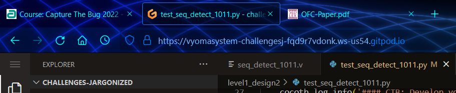
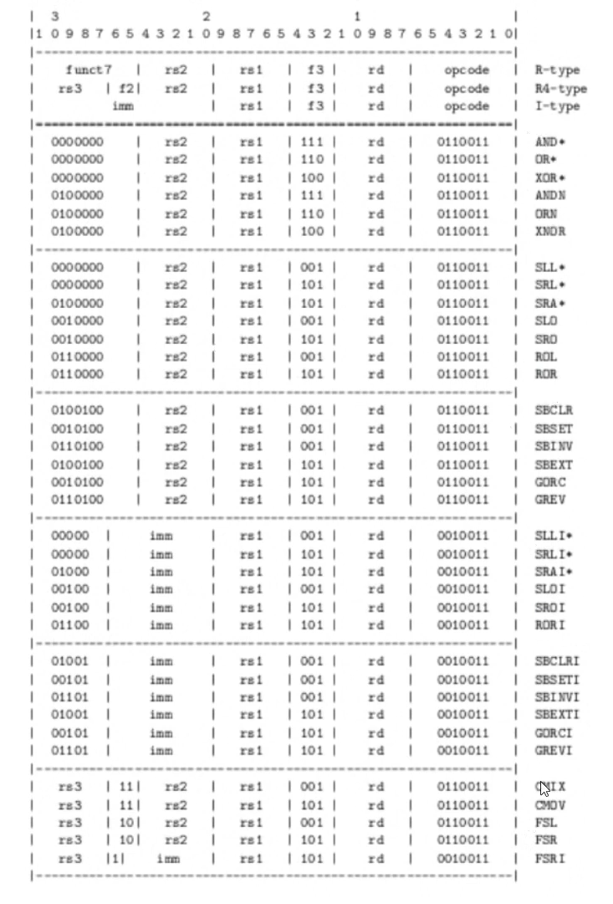
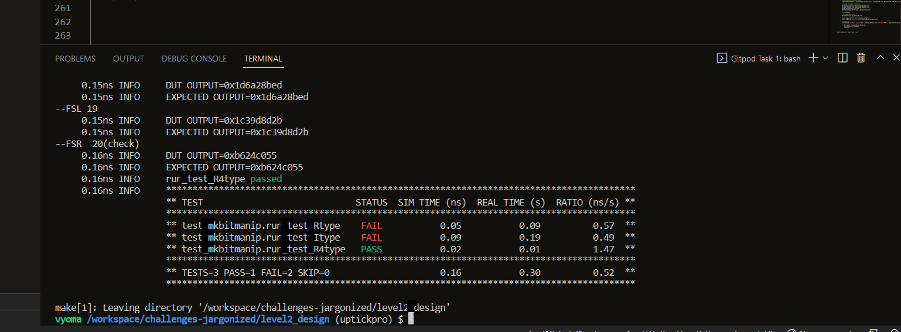
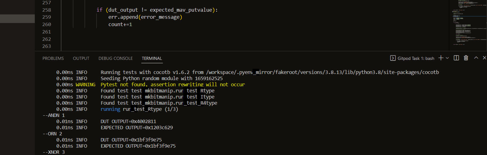
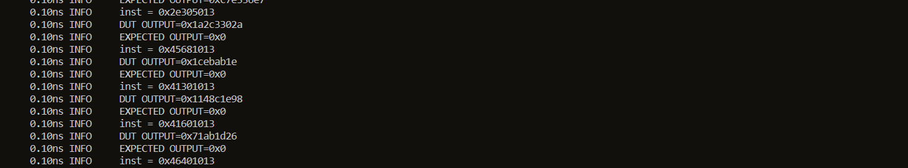

# Bitmanipulation Coprocessor

## Gitpod Environment

The verification environment is setup using Vyoma's UpTickPro provided for the hackathon.



## Verification Enivronment

The CoCoTb based Python test is developed as explained. The test drives inputs to the Design Under Test which takes in clock, reset, 32-bit instruction and 3 32-bit operands as inputs and the output is a 33-bit signal where the LSB denotes whether the output is valid or not.

Assert statement is used to raise a message when the actual and the expected output don't match.

## Verification Strategy

Firstly, the instruction was randomized. Since the instruction set is limited, this method didn't work.
Three test functions were written, each targeting one of the three instruction types(R-Type, R4-Type and I-Type).
Using the instruction sheet, the possible values that different parts of an instruction can assume were hand-coded and the operands were randomised.




## Test Scenario
```
// R-Type 
// don't care bits were assumed to be zeros in most of the cases
func7_1 = [0x40000000, 0x00000000, 0x60000000, 0x20000000]
func7_2 = [0x01000000, 0x09000000]
func3 = [0x0000F000, 0x0000E000, 0x0000C000, 0x00009000, 0x0000D000]
opcode = 0x000000B3
```

``` 
// R4-Type
func2 = [0x06000000,0x04000000]
func3 = [0x00001000, 0x00005000]
opcode = 0x00000033
```

```
// I-Type
func5 = [0x00000000,0x20000000,0x40000000,0x60000000]
func5_1 = [0, 134217728]
func3 = [0x00001000, 0x00005000]
opcode = 0x00000013
```




## Design Bug

The bugs identified are:

1. Incorrect result for ANDN


2. FSRI being confused with R4-Type instruction, thus leading to ambiguity.
The result was obtained when R4-Type instructions were tested.


## Design Fix
The task of fixing the bugs was not pursued for this module.


