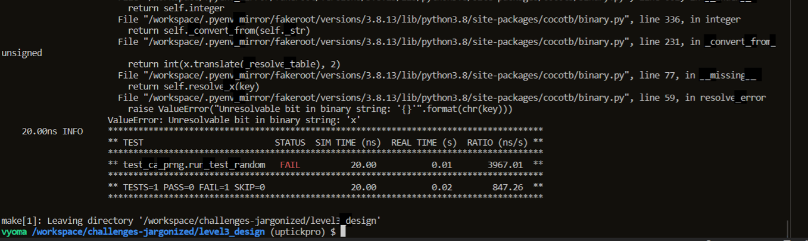
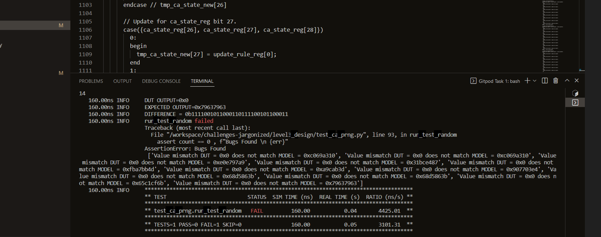
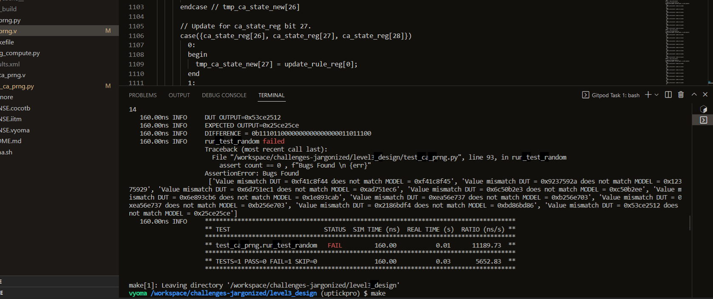
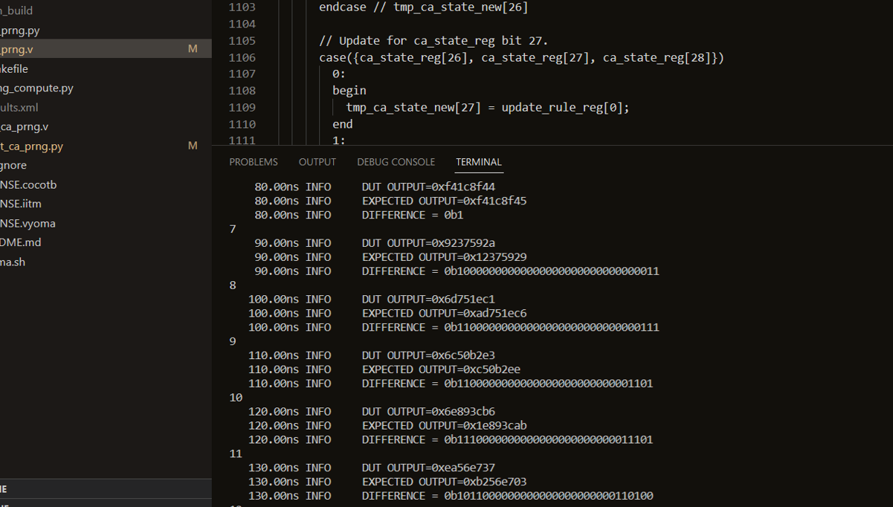
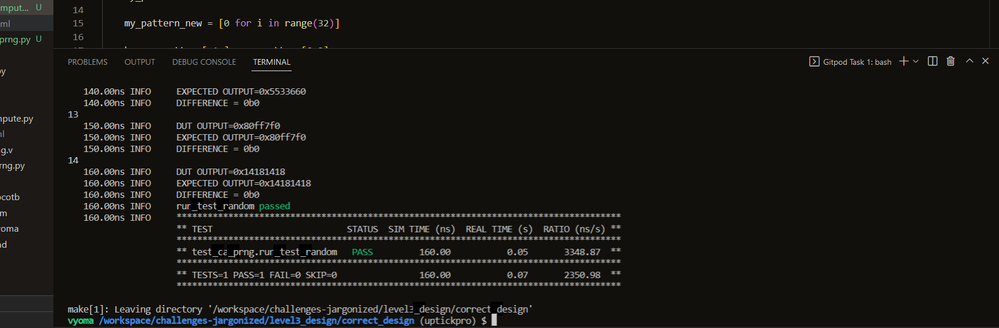

# Cellular Automaton PseudoRandom Sequence Generator

## Gitpod Environment

The verification environment is setup using Vyoma's UpTickPro provided for the hackathon.


## Verification Enivronment

The CoCoTb based Python test is developed as explained. The test drives inputs to the Design Under Test which takes in clock, reset, a 32-bit signal representing initial load pattern, a 8-bit signal representing update rule, three 1-bit signals representing enable signal to load pattern, update rule and fetch next pattern, respectively as inputs and the 32-bit random pattern is obtained as the output.

Assert statement is used to raise a message when the actual and the expected output don't match.

## Bugs Inserted

```
// Bug1: Active Low Reset -> Active High Reset
// Lines 102-107
if (reset_n)
     begin
       // Register reset.
       update_rule_reg <= DEFAULT_RULE;
       ca_state_reg    <= 32'b00000000000000000000000000000000;
     end
```

```
// Bug2: The ring structure of the CA array is broken on one end
// Lines 131-134
always @*
  begin : ca_state_update
    // Update for ca_state_reg bit 0.
    case({ca_state_reg[0], ca_state_reg[0], ca_state_reg[1]})
```

```
// Bug3: CA State Register load condition modified (design spec. demands that load_init_pattern and next_pattern cannot be asserted simultaneously)
// Lines: 1297 - 1305
if (load_init_pattern && next_pattern)
  begin
       ca_state_we = 1;
     end
   else
     begin
       ca_state_we = 0;
     end
 end // ca_state_update
```

## Verification Strategy

Firstly, the clock signal is set up and fed to the DUT. Secondly, the DUT is reset.
For debugging the code, a random load_init_pattern and next_pattern was hand-coded. A python module was created to predict the expected output.

## Test Scenario
```
 initial = random.randint(0,4294967295)
 load_initial = [0,0,0,1,0,0,0,0,0,0,0,0,0,0,0]
 updaterule = 90
 defaultupdaterule = 30
 load_update = [0,0,0,1,0,0,0,0,0,0,0,1,0,0,0]
 nextpattern = [0,0,0,0,0,1,1,1,1,1,1,0,1,1,1]
 expected = [0,0,0,0,initial]
 my_update_rule = defaultupdaterule
```

Bug 1: The value is unknown after thus indicating a problem in reset



Bug 2: DUT output is always zero for all possible and valid input combinations, thus indicating an issue in the State Register modification block.



Bug 3: Difference is observed in the first and the last bit initially(which in due courses propagates through the Automaton), thus indicating an issue.



The third bug can be figured by observing the difference between the expected and the actual output. The position(index of CA) of difference reveals the bug. The bug slowly propagates through the automaton.




## Design Fix

The test worked perfectly for the correct module.




